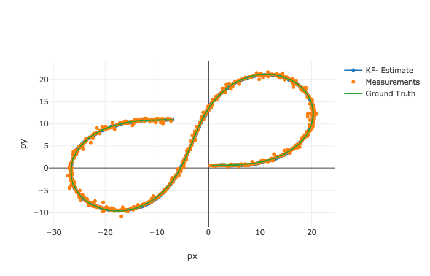
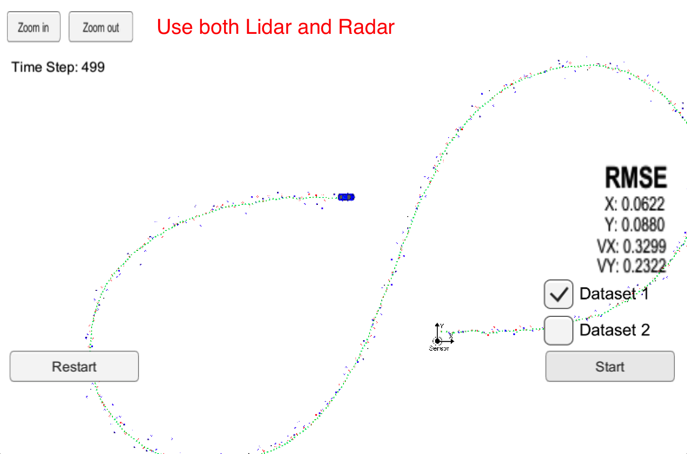
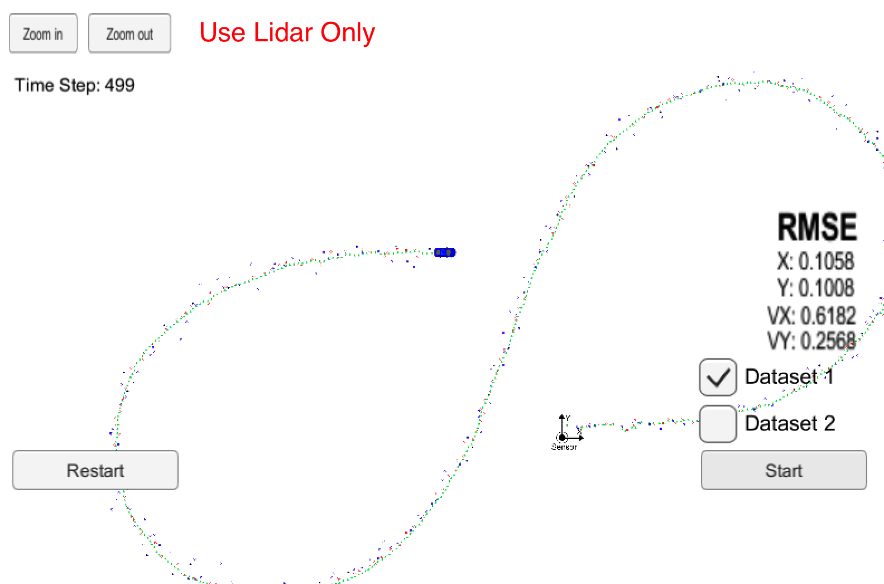
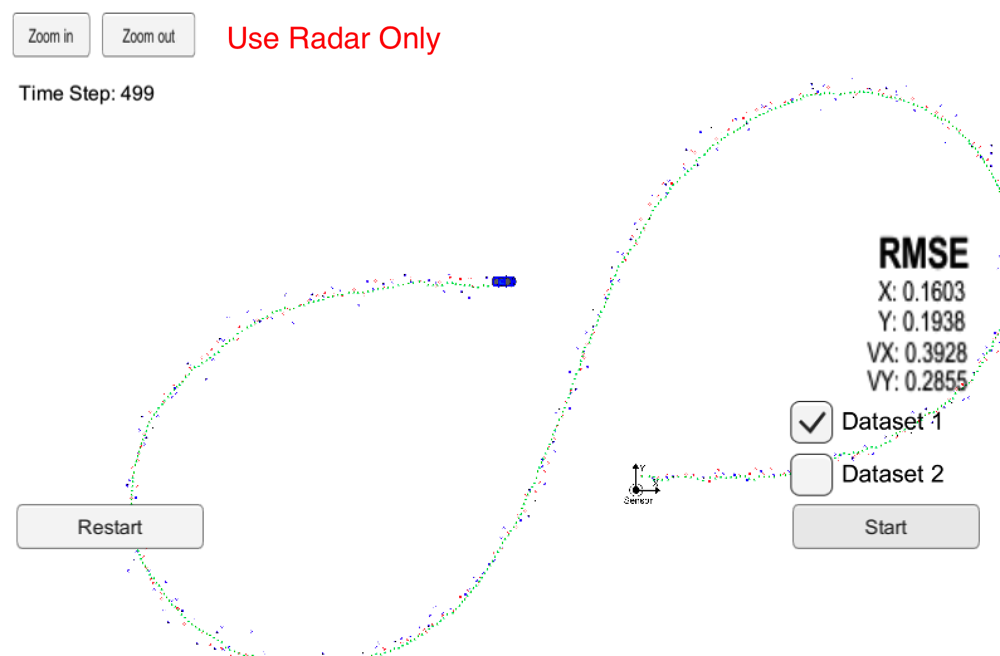

# Object Tracking with Unscented Kalman Filter

## Goal

Utilizes sensor data from simulated LIDAR and RADAR measurements for object tracking (e.g. cars, pedestrian or other moving objects) with the Unscented Kalman Filter.

The project was created with the [Udacity Starter Code](https://github.com/udacity/CarND-Unscented-Kalman-Filter-Project).

## Files
- `scr` a directory with the project code:
  - `main.cpp` - reads in data from input file or simulation tool, run the Kalman filter, and calculate RMSE
  - `ukf.cpp` - implements an Unscented Kalman Filter, making prediction and then updating states per each sensor measurement 
  - `tools.cpp` - a utility function to calculate RMSE
- `data`  a directory with one input file provided by Udacity
- `results`  a directory with the output log file and visualization image

## Results

### Input data file: obj_pose-laser-radar-synthetic-input.txt


Accuracy
* RMSE: <b>[0.0621189, 0.087899, 0.329564, 0.232066]</b>. This meets the expectation of RMSE <= [.09, .10, .40, .30]

The results were visualized with [Sensor Fusion utilities](https://github.com/udacity/CarND-Mercedes-SF-Utilities).

### Simulator Results
#### Use both Lidar and Radar as the input measurements


#### Use both only Lidar as the input measurements


#### Use both only Radar as the input measurements


## Run the code
* Compile
```
mkdir build && cd build
cmake .. && make
```
* Run as the server (getting input from the simulator)
```
cd build
./UnscentedKF
```

* Read from the local input data file. It will generate a output file `output.txt` in the same fold for the visualization purpose
```
cd build
./UnscentedKF ../data/obj_pose-laser-radar-synthetic-input.txt 
```
